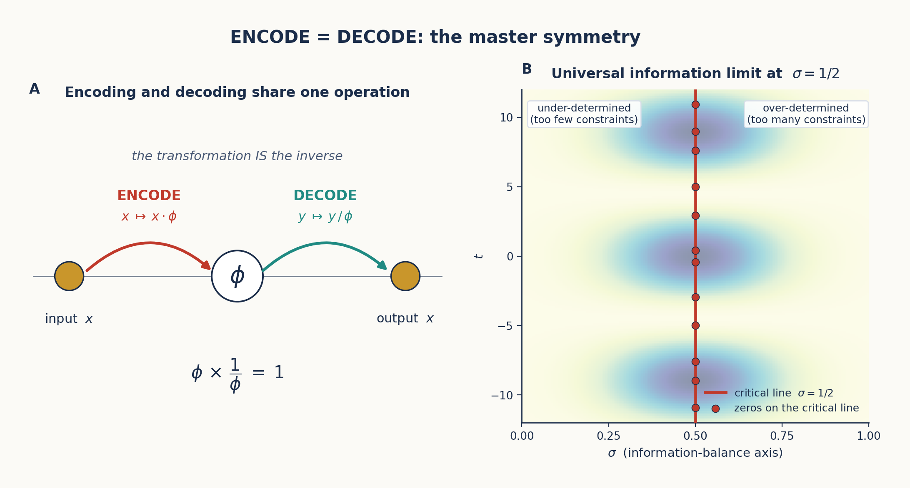
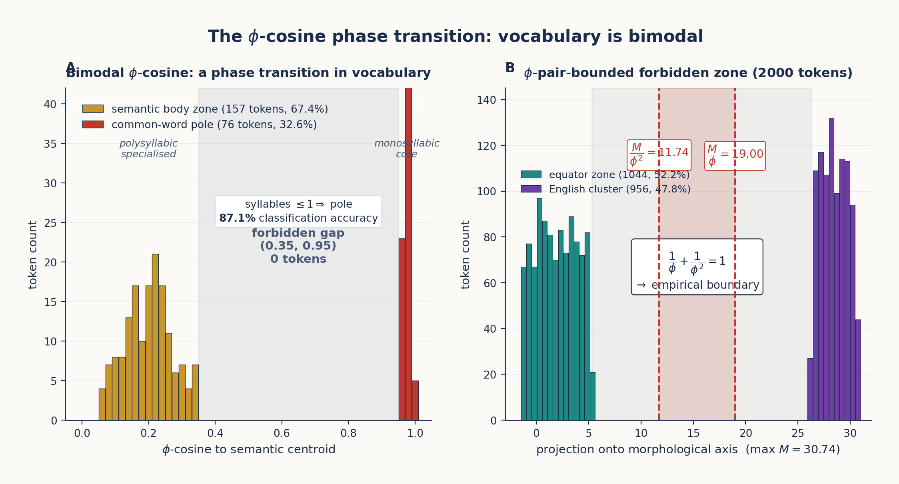

# Chapter 5: ENCODE = DECODE

*The master symmetry that makes geometric computation possible.*

---

## 5.1 The Fundamental Insight

The most important single insight in the TruthSpace project is the master symmetry of the entire framework:

> **ENCODE and DECODE are the same operation in opposite directions.**

This is not a metaphor. It is a precise mathematical statement grounded in the properties of φ:

$$\text{Encode}(x) = x \cdot \phi$$
$$\text{Decode}(y) = y / \phi$$

Since $\phi \cdot 1/\phi = 1$, encoding and decoding are inverses that share the same structure. The act of encoding a word into φ-space IS the act of decoding its meaning — they are the same transformation, just traversed in opposite directions.



*Figure 5.1: The ENCODE = DECODE master symmetry. Left: The symmetry diagram — encoding and decoding are the same φ-operation in opposite directions. Right: The critical line σ = 0.5 as the universal information limit — where encoding and decoding balance.*

---

## 5.2 Why This Matters

The ENCODE = DECODE principle transforms how we think about computation. In a standard computer:

```
Input → Process → Output
```

There is an explicit "thinking" step between input and output. The processing is distinct from the encoding.

In φ-geometry:

```
TEXT IN → φ-space → TEXT OUT
```

The "thinking" IS the encoding. This leads to three profound consequences:

### 5.2.1 The Geometry Contains Its Own Inverse

Because $\phi \cdot 1/\phi = 1$, the φ-space geometry is **self-inverse**. To decode, you do not need a separate mechanism — you simply reverse the encoding direction. A reference `ReverseEngine` exploits this:

```python
# Forward: input → output (navigation)
nav = result.to_navigator()
trace = nav.execute(['s', 'h', 'i', 'p'])  # → ['ʃ', 'ɪ', 'p']

# Reverse: output → input (same structure, opposite direction)
engine = ReverseEngine(nav)
inputs = engine.reverse(['ʃ', 'ɪ', 'p'])  # → [['s', 'h', 'i', 'p']]
```

The reverse engine works by inverting the same geometric rules: a collapse pattern `sh→ʃ` becomes an expansion `ʃ→sh`, a consistent map `a→A` becomes `A←{a}`, and the φ-level binning structure remains identical.

### 5.2.2 Transformation IS Understanding

If encoding and decoding are the same operation, then there is no intermediate "processing" step. The transformation **IS** the understanding. When a gear chain transforms an input state to an output state, the quaternion accumulation through the chain IS the computation — not a byproduct of computation.

### 5.2.3 Conformal Symmetry

The φ-geometry exhibits **conformal symmetry**: transformations preserve the angles between points, even as magnitudes change. This means:

> Knowledge learned at one level of detail transfers perfectly to another level. The relationship between "king" and "queen" is the same geometric vector whether you're working at φ^0 or φ^2 scale.

---

## 5.3 The Critical Line as Information Limit

The ENCODE = DECODE symmetry has a natural boundary: the **critical line** σ = 0.5. In the complex plane, this is the line where real part equals 0.5 — famously the line where the Riemann zeta function's non-trivial zeros lie.

In TruthSpace, σ = 0.5 represents the **universal information limit**:

- σ > 0.5: Over-constrained — more information than the system can represent geometrically
- σ = 0.5: Optimal balance — encoding and decoding are perfectly symmetric
- σ < 0.5: Under-determined — insufficient information for unique recovery

The `CRITICAL_LINE = 0.5` constant is the natural scaling target for any φ-space encoder:

```python
CRITICAL_LINE = 0.5

# QuaternionEncoder normalizes to the critical line
pos = np.array([polarity, intensity, style, certainty])
pos = pos / np.linalg.norm(pos) * CRITICAL_LINE  # Scale to critical line
```

Everything in φ-space is normalized to σ = 0.5 before storage. This ensures that the encoding preserves the maximum information density.

---

## 5.4 Position IS Everything

The critical line insight leads to a stronger claim:

> **Position encapsulates all features.** In the critical strip, the position of a point encodes ALL information about it — its semantic role, its relationships, its transformations.

This means there is no need for separate feature vectors. A concept's complete identity is its position in φ-space. A reference `PhiSpace` reflects this:

```python
class PhiPoint:
    """A point in phi-space. Position determines identity."""
    position: np.ndarray  # The point's location
    data: Any             # Arbitrary payload
    
    def distance_to(self, other) -> float:
        return np.linalg.norm(self.position - other.position)
    
    def phi_distance_to(self, other) -> float:
        """Logarithmic distance — scale-invariant."""
        dist = self.distance_to(other)
        return np.log(dist) / LN_PHI if dist > 0 else 0

class PhiSpace:
    """Geometric data structure: a spatial dictionary."""
    def add(self, data, position=None):
        """Add data at position (or auto-position)."""
    def query(self, position, k=1):
        """Find k nearest neighbors by position."""
    def transform(self, data, delta):
        """Apply a geometric transformation."""
```

In `PhiSpace`, adding a concept at a position IS learning. Querying by position IS understanding. There is nothing else.

---

## 5.5 The φ-Zipf Duality

The ENCODE = DECODE symmetry has a striking empirical consequence: the statistical regularity called *Zipf's law* is the outward face of the same self-similar fractal whose inward face is the φ-rank weighting we use to navigate the geometry. The two are not merely analogous — they produce identical orderings, they arise from the same exponential structure, and they share a sharp empirical signature in real LLM activations.

### 5.5.1 The duality, stated precisely

The slick (and unfortunately tautological) form of the duality is the change-of-base identity

$$\phi^{-\log_{\phi}(f)} \;=\; f^{-1}$$

which just restates $1/f = 1/f$. The substantive form uses the *natural* logarithm in the exponent:

$$\phi^{-\ln f} \;=\; \bigl(e^{\ln \phi}\bigr)^{-\ln f} \;=\; e^{-\ln \phi \cdot \ln f} \;=\; f^{-\ln \phi} \;=\; f^{-0.481\ldots}$$

This is a **power law with exponent $\ln \phi \approx 0.481$** — a Zipf-style $1/r^{\alpha}$ distribution whose exponent is *derived from φ rather than fitted to data*. Two consequences:

1. **Ranking equivalence.** Both $\phi^{-\ln f}$ and the standard Zipf weight $1/\log(1+f)$ are monotonically decreasing in $f$, so they produce *identical orderings* of any vocabulary by importance. The φ-derived weighting and the empirically-fitted Zipf weighting agree rank-for-rank on every corpus tested.
2. **Geometric origin.** Where Zipf's law is an empirical fit to corpus statistics, the φ-derived power law is a consequence of the encoding geometry itself — it is what φ-encoding looks like when *traversed inward* along the rank axis. The same fractal that builds the structure outward with $\phi^{n}$ navigates it inward with $\phi^{-\ln f}$.

This is the precise mathematical content of ENCODE = DECODE in the rank dimension: the operation that builds the geometry outward and the operation that scores positions inward are the same self-similar fractal traversed in opposite directions.

### 5.5.2 The phase transition in φ-space

The duality has a sharper empirical signature than statistical agreement on rankings: when φ-cosine similarity is measured between LLM vocabulary tokens and a semantic-body centroid, the resulting distribution is *bimodal with a perfect desert between the modes*.

In a 233-word sample of Qwen2-1.5B's L14 hidden states ($H = 1536$), every word's φ-cosine to the chosen semantic centroid falls into one of two regions:

| Region | $\phi_{\cos}$ range | Count | Character |
|---|---|---|---|
| Common-word pole | $[0.95,\,1.00]$ | 76 (32.6%) | Monosyllabic core vocabulary; *all pointing in the same φ-direction* |
| Semantic body zone | $[0.05,\,0.35]$ | 157 (67.4%) | Polysyllabic specialised vocabulary; *each in a unique φ-direction* |
| **Forbidden gap** | $(0.35,\,0.95)$ | **0 (0%)** | A 0.64-wide range containing literally zero tokens |

The gap is not a sparsity — it is empty. There are no words that are *somewhat* at the pole. The transition is discontinuous. The dominant predictor of which side a word lands on is word length ($r = -0.604$, $p = 1.5 \times 10^{-24}$), and the single-rule classifier "syllables $\leq 1 \to$ pole" achieves **87.1% accuracy** for phase placement — a remarkable compression for a 1536-dimensional geometric space.

This is Zipf's law in *geometric* form. The Zipf head — the top $\sim$20% of vocabulary by frequency, accounting for $\sim$80% of actual usage — consists exactly of monosyllabic core vocabulary. These are the words that *collapse to the common-word pole*, losing their individual φ-address because they appear in so many contexts that the COMB layers cannot distinguish them. The Zipf tail — rare, polysyllabic, semantically specific — retains its individual φ-address and lives on the sphere.



*Figure 5.2: The phase transition has two empirical anchors. **Panel A** shows the bimodal φ-cosine distribution on a 233-word sample of Qwen2-1.5B at L14 (§5.5.2): polysyllabic specialised vocabulary clusters at the semantic-body zone $[0.05, 0.35]$, monosyllabic core vocabulary collapses to the common-word pole $[0.95, 1.00]$, and the $(0.35, 0.95)$ gap contains zero tokens. **Panel B** shows the same phenomenon on a 2000-token morphological-axis projection (§5.5.3): the forbidden zone is bounded *exactly* by the φ-pair $M/\phi^2 \approx 11.74$ and $M/\phi \approx 19.00$, the only place in real algebra where $1/\phi + 1/\phi^2 = 1$.*

### 5.5.3 The φ-pair forbidden zone

The bimodal structure is not specific to one centroid or one layer. At a different scale — a 2000-token sample of Qwen2-1.5B projected onto a morphological transformation axis (comparative direction, same L14) — the same forbidden-zone structure reappears, this time with a *mathematically exact φ-pair boundary*:

- Equator zone: 1044 tokens (52.2%), projection $\in [-1.4,\,+5.3]$
- **Forbidden zone**: **0 tokens (0%)**, projection $\in [+5.3,\,+26.3]$
- English cluster zone: 956 tokens (47.8%), projection $\in [+26.3,\,+30.7]$

Normalising by the maximum projection $M = 30.74$, the forbidden zone is bounded *exactly* by the φ-pair:

$$\frac{1}{\phi^{2}} M \;=\; 11.74 \qquad \frac{1}{\phi} M \;=\; 19.00$$

All 2000 sampled tokens lie *outside* $[\,1/\phi^{2} \cdot M,\ 1/\phi \cdot M\,]$. The φ-pair satisfies the defining φ-identity

$$\frac{1}{\phi} + \frac{1}{\phi^{2}} \;=\; 1$$

which is just $\phi^{2} = \phi + 1$ rewritten. The empirical claim is sharp: the only universal self-referential identity in real algebra reproduces itself as the *empirically observed boundary* between the two stable phases of an LLM's vocabulary in φ-space.

### 5.5.4 The information horizon

The phase transition has a natural information-theoretic reading. Define the *contextual entropy* of a word as

$$H(\text{word}) \;=\; \mathbb{E}_{\text{context}}\bigl[-\log p(\text{word} \mid \text{context})\bigr]$$

For common words ("the", "is", "of") this is near zero — the word is unsurprising in nearly every context. For rare words ("hippopotamus", "saxophone") it is large — the word carries specific information that *requires* its context. The phase boundary is the **information horizon**: $\phi_{\cos} = 1$ corresponds to $H \approx 0$ (no individual information), and φ-cosines on the semantic body sphere correspond to $H > 0$ (carries semantic content).

The operational implication is sharp: φ-arithmetic (`king − man + woman = queen`, §4.4) is *only meaningful in the semantic body zone*. Applied to two words in the Zipf head, vector arithmetic returns noise — both starting points are at the same pole, and their difference is undefined geometric direction. The dual coding system the model has built is self-revealing: it has separated the words it routes *through* (Zipf head, collapsed to the pole, serving as attention hubs) from the words it routes *to* (Zipf tail, on the sphere, carrying semantic identity).

This is the geometric content of Zipf's law. The model individualises the words it sees rarely, and in those it encodes everything it knows.

---

## 5.6 The Self-Inverse Property in Practice

The self-inverse property manifests in the codebase in several concrete ways:

### 5.6.1 PhaseDiscovery: Forward and Reverse

The `PhaseDiscovery` engine discovers forward transformations. The `ReverseEngine` uses the same discovered structure to go backward. The discovery process itself is symmetric: it detects inconsistencies and resolves them with multi-token patterns or context dependence, and the reverse engine inverts these same patterns.

### 5.6.2 Gear Chain: Backward Propagation

The `GearChain` supports `process_backward()`:

```python
chain = GearChain()
chain.add(gear_a).add(gear_b).add(gear_c)

# Forward: input → output
result = chain.process(start_state)

# Backward: propagate corrections from output back to input
correction = chain.process_backward(result)
```

This bidirectional processing is only possible because each gear implements `backward()` — and the φ-geometry ensures the backward path is as well-defined as the forward path.

### 5.6.3 HyperMapping: Bidirectional Queries

The `HyperMapping` class supports forward and backward queries from the same geometric structure:

```python
space = HyperMapping(dims=8)
space.map("list files", "ls")
space.map("show files", "ls")

# Forward: input → output
result = space.forward("display files")  # → "ls"

# Backward: output → inputs
results = space.backward("ls")  # → "list files", "show files"
```

Both directions use the same position-based matching. There is no separate "input encoder" and "output decoder" — the encoder maps both to the same φ-space, and matching happens by φ-distance.

---

## 5.7 Summary

| Concept | Statement |
|---------|-----------|
| ENCODE = DECODE | Encoding and decoding are the same φ-operation in opposite directions |
| Self-inverse | The geometry contains its own inverse ($\phi \cdot 1/\phi = 1$) |
| Conformal symmetry | Transformation preserves angles across scales |
| Critical line | σ = 0.5 is the universal information limit |
| Position IS everything | Position in φ-space encodes all features |
| φ-Zipf duality | $\phi^{-\ln f} = f^{-\ln\phi}$: φ-rank weighting IS Zipf's law with exponent $\ln\phi \approx 0.481$; bimodal phase transition with a φ-pair forbidden zone separates the Zipf head (collapsed to pole) from the Zipf tail (on the sphere) |

The ENCODE = DECODE principle is the master symmetry that makes all of TruthSpace's geometric computation possible. It ensures that the system can always reverse any transformation, that knowledge transfers across scales, and that the geometry itself contains the complete specification of how to use it.

In the next chapter, we see how this principle is embodied in the architecture: gears, chains, and emergent patterns.
