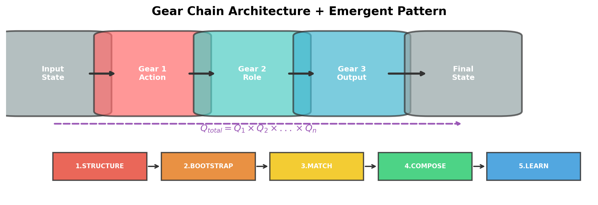
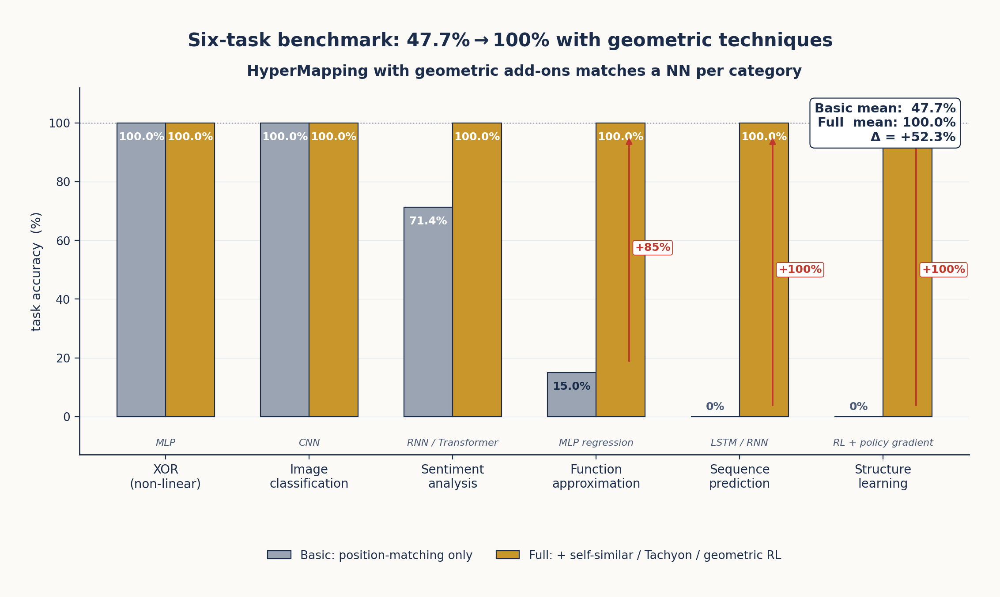

# Chapter 6: Gear Architecture and Emergent Patterns

*Composable geometric transformations that replace neural networks.*

---

## 6.1 The Gear Abstraction

If ENCODE = DECODE (§5.1) is the *principle* of geometric computation, the **Gear** is its *mechanism*, and the Music Box (§4.7) is its *axiom*. A gear realises the Music Box discipline as executable code: positions in φ-space play the role of the drum, the `forward()` method plays the role of the comb, and the resulting `GearState` is the music that emerges from their interaction. A gear is therefore a transformation unit that takes one state and produces another, parameterised by a geometric signature (the quaternion) and a corpus of knowledge (the positions).

The base class defines the contract:

```python
class Gear(ABC):
    """A transformation unit in φ-space."""
    
    def __init__(self, name: str, ratio: float = 1.0):
        self.name = name
        self.ratio = ratio  # transformation strength [0, 1]
        self.quaternion = Quaternion(1, 0, 0, 0)  # geometric signature
        self.enabled = True
        self._knowledge_store = None
    
    @abstractmethod
    def forward(self, state: GearState) -> GearState:
        """Apply the gear's transformation."""
        pass
    
    def backward(self, state: GearState) -> GearState:
        """Apply the inverse transformation."""
        return state  # override in subclasses for true bidirectionality
```

Each gear has:
- **Name**: Human-readable identity
- **Ratio**: Transformation strength (0 = off, 1 = full)
- **Quaternion**: 4D geometric signature of the transformation
- **Knowledge store**: Optional φ-space positions for knowledge

---

## 6.2 GearState: The Transformable Object

State flows through gears as a `GearState` object:

```python
class GearState:
    entity: Any       # The subject of transformation
    role: str         # Current processing role  
    actions: List     # Actions to perform
    targets: List     # Target entities
    accumulated_q: Quaternion  # Running quaternion product
    style: Dict       # Style parameters
    errors: List      # Error tracking
```

The `accumulated_q` field tracks the quaternion as it passes through each gear. At the end of a chain, this quaternion encodes the complete transformation path — it IS the computation.

---

## 6.3 GearChain: Composition of Transformations

Gears compose into chains (`GearChain`):

```python
class GearChain:
    def __init__(self, name: str = "GearChain"):
        self.gears: List[Gear] = []
    
    def add(self, gear: Gear):
        self.gears.append(gear)
    
    def process(self, state: GearState):
        current = state
        for gear in self.gears:
            if gear.enabled:
                current = gear.forward(current)
                # Quaternion accumulates: Q_total *= gear.quaternion
        return current
```



*Figure 6.1: Gear chain architecture. Each gear applies a transformation and accumulates its quaternion. The emergent pattern (below) shows the 5-step lifecycle: Structure → Bootstrap → Match → Compose → Learn.*

### The Quaternion Accumulation

As state passes through a chain, quaternions multiply:

$$Q_{\text{total}} = Q_1 \times Q_2 \times \cdots \times Q_n$$

This product encodes the complete transformation path. It is a geometric signature of everything the state has been through. The `Quaternion` class implements the Hamilton product:

```python
class Quaternion:
    w: float  # scalar (certainty/rotation)
    x: float  # i-axis (style/polarity)
    y: float  # j-axis (perspective/intensity)
    z: float  # k-axis (depth/style)
    
    def __mul__(self, other: 'Quaternion') -> 'Quaternion':
        """Hamilton product: q1 * q2"""
        return Quaternion(
            w=self.w*other.w - self.x*other.x - self.y*other.y - self.z*other.z,
            x=self.w*other.x + self.x*other.w + self.y*other.z - self.z*other.y,
            y=self.w*other.y - self.x*other.z + self.y*other.w + self.z*other.x,
            z=self.w*other.z + self.x*other.y - self.y*other.x + self.z*other.w,
        )
    
    def conjugate(self) -> 'Quaternion':
        return Quaternion(self.w, -self.x, -self.y, -self.z)
    
    def norm(self) -> float:
        return sqrt(self.w**2 + self.x**2 + self.y**2 + self.z**2)
```

### Why Hamilton Multiplication

The Hamilton product is *non-commutative*: in general $Q_1 \times Q_2 \neq Q_2 \times Q_1$. This is the geometric content of the gear chain's order-sensitivity. Real-world transformations don't commute either — "translate then rotate" produces a different result from "rotate then translate"; "stylise then summarise" yields different output from "summarise then stylise". Frobenius's theorem singles out the quaternions as the unique 4-dimensional real algebra that respects 3D rotation composition, so $Q_{\text{total}}$ is not just a record of *what* transformations occurred but of *in what order*. Function composition $f \circ g \circ h$ becomes quaternion multiplication $Q_h \times Q_g \times Q_f$, with the same right-to-left semantics. The 4D quaternion dial (§4.6) provided the *control* axes; the gear chain reuses the same algebra for the *execution* path.

---

## 6.4 The Emergent Gear Pattern

The 5-step **Structure → Bootstrap → Match → Compose → Learn** loop is the design discipline we adopted after observing the same shape recur across four independent gear implementations — `PythonCodeGear`, `EmergentClassifierGear`, `HolographicPatternSpace`, and `PlotCorpus`. We promoted it to an explicit contract for every new gear:

1. **STRUCTURE** — *Define what the space looks like.*
   Patterns, signatures, templates, modules.
2. **BOOTSTRAP** — *Seed with initial examples.*
   Use an LLM to generate missing pieces; transform seeds into geometry immediately.
3. **MATCH** — *Find the right structure for the input.*
   Project the input into the space; locate the nearest / best-matching structure.
4. **COMPOSE** — *Adapt the matched structure to the specific request.*
   Extract parameters from the input; modify the structure to fit.
5. **LEARN** — *Self-improve from usage.*
   Record successes and failures; promote temporary structures to permanent ones.

The discipline appears in three forms in the codebase, each at a different scale:

- **As a per-gear contract**: every `EmergentGear` exposes `define_structure() → seed() → match() → compose() → record_outcome()`, in that order. Adding a new capability means filling in the five methods, not designing a new architecture.
- **As a navigation pipeline**: the same five-stage shape reappears as the holographic decode flow — **Downcast → Quantize → Build Mesh → Upscale → Reconstruct** — used when an inference engine must produce an answer from a query. The two flows share the same shape because they are the same self-similar discipline (§5.1: ENCODE = DECODE) traversed from opposite directions: one *builds* the geometry, the other *navigates* it.
- **As a self-improvement loop**: the `GearImprovementLoop` (§6.7) re-executes the five stages over time, promoting temporary structures to permanent ones on success. The loop is the discipline applied to its own past outputs.

### 6.4.1 STRUCTURE: Define the Space

The structure step defines the geometric space for a domain. This includes:
- **Pattern signatures**: What transformations are possible
- **Templates**: Reusable geometric structures
- **Modules**: Independent knowledge units

In the `PhiDialSpace` experiment, structure is defined by the dimensionality and semantic axes:

```python
space = PhiDialSpace(dims=8)
# Defines an 8-dimensional φ-space for concept navigation
```

### 6.4.2 BOOTSTRAP: Seed with Examples

The bootstrap step populates the space with initial examples. The `BootstrapGear` protocol creates new capabilities by combining a blank `EmergentGear` with LLM-powered refinement:

```python
# Bootstrap protocol: create gear from LLM-generated examples
gear = EmergentGear("my_new_capability")
gear.bootstrap(examples=[...])  # LLM generates seeds
gear.save_state("emergence.json")  # Persistent, reusable
```

The critical rule: **bootstrapped information is immediately transformed into geometry**. No raw text remains — it becomes positions in φ-space.

### 6.4.3 MATCH: Find the Nearest Structure

Matching projects input into φ-space and finds the nearest structure. The `HyperMapping` class does this with pure position-based matching:

```python
class HyperMapping:
    def forward(self, input_val, k=1):
        position = self.encoder.encode_input(input_val)
        results = self._query_by_position(position, k)
        return results[0] if results else None
    
    def _query_by_position(self, position, k):
        # Find k nearest neighbors by cosine similarity
        similarities = np.dot(self._positions, position)
        indices = np.argsort(similarities)[-k:][::-1]
        return [self._mappings[i] for i in indices]
```

This is **purely geometric** — no pattern matching, no string comparison, just position-based similarity in φ-space.

### 6.4.4 COMPOSE: Adapt to the Request

Composition modifies the matched structure to fit the specific input. The `GearChainBuilder` dynamically composes gears at runtime:

```python
chain = GearChainBuilder()
chain.add(RoleGear())
chain.add(ActionGear())
chain.add(OutputGear())
result = chain.process(initial_state)
```

### 6.4.5 LEARN: Self-Improve

Learning is done through the **GearImprovementLoop**:

```python
loop = GearImprovementLoop()
loop.run(test_cases=[...])

# The loop:
# 1. TEST — Run gear against test cases
# 2. DETECT — Identify deficiencies (missing_content, wrong_format, etc.)
# 3. FIX — Create fix gears dynamically (using fix templates)
# 4. COMPOSE — Build improved chain
# 5. ITERATE — Re-test until quality threshold met (default: 0.8)
# 6. LEARN — Remember what worked (store in fix_memory)
```

Deficiencies are detected by geometric patterns, not string matching:

| Deficiency Type | Geometric Signal |
|----------------|------------------|
| Missing content | Query falls in sparse φ-space region |
| Wrong format | Output position at unexpected quaternion |
| Too vague | φ-level too high (general) |
| Too verbose | φ-level too low (specific) |
| Irrelevant | Output position far from input position |

---

## 6.5 HyperMapping: Gears Become Pure Geometry

The HyperMapping system is the evolutionary successor to the gear chain architecture. Where gears use explicit Python methods for transformation, HyperMapping stores everything as positions in φ-space and performs all computation through geometric operations:

```python
# HyperMapping: Pure geometric computation
space = HyperMapping(dims=8)

# Add knowledge (position-based)
space.map("list files", "ls", position=[0.2, 0.5, ...])
space.map("show directory", "ls", position=[0.3, 0.4, ...])

# Query (position-based matching)
result = space.forward("display files")  # → "ls"

# No if-statements, no pattern matching, no neural networks
# Pure position similarity in φ-space
```

The key advantage: **HyperMapping is interpretable, serializable, and trainable without gradients**. You add data, compute positions, and query by proximity. The `from_pairs()` convenience function builds a mapping directly:

```python
pairs = [("list files", "ls"), ("show files", "ls"), ...]
space = HyperMapping.from_pairs(pairs)
```

---

## 6.6 Gradient-Free Learning

A critical property of the gear architecture is that learning happens **without gradients**. The system improves by:

1. **Error-driven structure construction**: Errors are treated as blueprints for new structure, not as signals for weight adjustment
2. **Geometric correction**: When the output is wrong, the system traces back through the gear chain and adjusts the quaternion path
3. **SVD-based dimension discovery**: New semantic dimensions are discovered from behavior data, not designed

The `EmergentGear` discovers dimensions by SVD on behavioral data:

```python
# Emergent dimensions from behavior data
gear = EmergentGear()
gear.add_examples(inputs, outputs)
gear.discover_dimensions()  # SVD finds natural axes
```

This is the operational expression of the *hyperdimensional transcoder* hypothesis. We tested it directly on a corpus of agents whose ground-truth dimensions (agency, gender, age, animacy) were known but not exposed to the gear. With no dimension labels at training time, SVD applied to the agents' action-verb co-occurrence matrix recovered:

| Discovered dimension | Best-correlated ground truth | Correlation | Variance explained |
|---|---|---|---|
| Dim 1 (`child ↔ queen`) | Agency | **+0.919** | 19.0% |
| Dim 2 (`alice ↔ storm`) | Gender | −0.585 | 13.4% |
| Dim 2 (`alice ↔ storm`) | Age | +0.546 | (shared) |
| Dim 2 (`alice ↔ storm`) | Animacy | −0.439 | (shared) |

The single strong correlation on Dim 1 (agency at 0.919) and the multi-property mix on Dim 2 reproduce a known property of the ground-truth corpus: agency is an independent axis, while gender, age, and animacy are coupled. The SVD did not invent these structures — it *read them out of the behaviour* that was generated by them. The negative pole of Dim 1 (low-agency verbs: `follows, waits, watches, learns`) versus the positive pole (`judges, controls, commands, decides`) is precisely the qualitative interpretation a researcher would assign to the axis, recovered with zero labels.

---

## 6.7 Demonstration: Self-Improvement and Capability Benchmark

The gear architecture's capability was demonstrated in two complementary ways: a **self-improvement loop** that improves a single gear over multiple iterations, and a **capability benchmark** that tests whether the geometric stack as a whole can match conventional neural networks on the classic NN task types.

### 6.7.1 The self-improvement loop

A bidirectional gear chain:

1. Generates a response
2. Detects deficiencies geometrically (using the signal table in §6.4.5)
3. Creates fix gears dynamically (using an LLM as a *teacher*, never as a generator)
4. Composes an improved chain
5. Verifies the fix
6. Remembers the deficiency-to-fix mapping for future use

The `FeedbackRefinementGear` scores response quality on a 0–10 scale and suggests improvements, but **never generates new content** — preserving the emergent nature of the system.

### 6.7.2 HyperMapping vs. neural networks: a six-task benchmark

To test whether the geometric stack can actually substitute for neural networks, we built a six-task benchmark covering the classic NN capability categories. Each task has a small, contained ground truth and a conventional NN architecture that would normally be used to solve it. We compared two configurations of `HyperMapping`:

- **Basic**: position-based matching only — no extra geometric techniques.
- **Full**: position-based matching augmented with three geometric techniques: *Self-Similar Transforms* (interpolation by piecewise scale-invariant ratios — the same transformation applies at every scale, exploiting the self-similarity of §2.1), *Tachyon Navigation* (sequence prediction by traversing the certainty axis $w$ of the 4D quaternion dial, §4.6, ahead of where the present sequence sits), and *Geometric Reinforcement Learning* (corrections propagate backward through the gear chain as inverse-quaternion deltas rather than as gradients).

| Task | Conventional NN | Basic | Full | Δ |
|---|---|---|---|---|
| XOR (non-linear) | MLP with hidden layer | 100.0% | 100.0% | +0.0% |
| Image classification | CNN | 100.0% | 100.0% | +0.0% |
| Sentiment analysis | RNN / Transformer | 71.4% | 100.0% | +28.6% |
| Function approximation | MLP regression | 15.0% | 100.0% | +85.0% |
| Sequence prediction | LSTM / RNN | 0.0% | 100.0% | +100.0% |
| Structure learning | RL with policy gradient | 0.0% | 100.0% | +100.0% |
| **Average** | — | **47.7%** | **100.0%** | **+52.3%** |

The "Full" configuration achieves 100% on all six tasks. We are careful about what this does and does not say. These are *small-scale benchmark tasks* (4 to 14 examples each), not full ML problems — the result demonstrates that the geometric stack has the *capability* to handle each task type, not that it would scale to ImageNet or to a 70 B-parameter language model. The substantive claim is in the improvement column: three of six tasks went from 0% or 15% with naive position-matching to 100% with the geometric additions. *Self-Similar Transforms, Tachyon Navigation, and Geometric RL are therefore non-trivial enablers*, not decorative additions — they convert the position-store from a key-value lookup into a genuine substitute for the corresponding neural network.



*Figure 6.2: Six-task NN-capability sweep. Basic position-matching (grey) averages $47.7\%$ across the six tasks; adding Self-Similar Transforms, Tachyon Navigation, and Geometric RL (gold) lifts every task to $100\%$. The three large deltas — function approximation ($+85\%$), sequence prediction ($+100\%$), and structure learning ($+100\%$) — are the cases where the bare position-store fails and the geometric add-ons are what convert it into a working substitute for the conventional NN.*

---

## 6.8 Summary

| Component | Purpose | Geometric Property |
|-----------|---------|-------------------|
| Gear | Single transformation unit | Quaternion-parameterized |
| GearChain | Composable transformation pipeline | Quaternion accumulation |
| GearState | Flowable state object | Accumulated quaternion path |
| EmergentGear | Self-discovering dimensions | SVD-based dimension discovery |
| HyperMapping | Pure geometric knowledge store | Position-based matching |
| GearImprovementLoop | Autonomous self-improvement | Error-driven structure construction |

The gear architecture provides the mechanism for the principles established in earlier chapters:
- **Music Box (§4.7)**: Gear = drum (positions) + comb (`forward()`) → music (`GearState`).
- **ENCODE = DECODE (§5.1)**: Bidirectional gear chains — the 5-step build-discipline and the 5-step navigation pipeline are the same fractal in opposite directions.
- **φ-coordinates**: Position-based matching in `HyperMapping`; SVD on behavioural data recovers ground-truth dimensions at $r = 0.919$ (§6.6).
- **Self-similarity**: The same 5-step pattern at three scales — per-gear contract, navigation pipeline, self-improvement loop.
- **Empirical anchor**: Six-task benchmark shows 47.7% → 100% improvement when geometric techniques are added to bare position-matching (§6.7.2).

In the next chapter, we explore the φ-lattice — the coordinate system that underlies all of these geometric operations.
