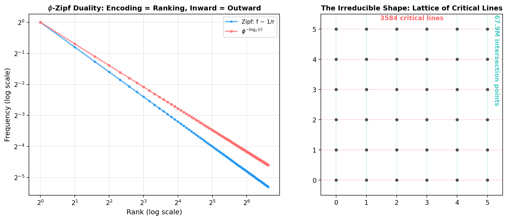

# Chapter 10: The Irreducible Shape and the φ-Zipf Spectrum

*The minimal structure of geometric computation.*

---

## 10.1 The Search for the Irreducible

Throughout the previous chapters, we have progressively stripped away layers of complexity from neural computation:

- Weights are not parameters → they are φ-coordinates (Chapter 3)
- Computation is not matrix operations → it is φ-navigation (Chapter 9)
- Attention is not statistical → it is spatial routing through φ-space (Chapter 9)
- The transformer IS a φ-computer (Chapter 8)

What remains when we strip away everything non-essential? What is the **irreducible shape** of computation?

The answer [141]:

> The irreducible shape is a lattice of 3,584 critical lines dividing semantic space into 67,942,912 binary intersection points at 1 bit each.



*Figure 10.1: Left — The φ-Zipf duality: φ-encoding and Zipf frequency are the same fractal viewed from opposite directions. Right — The irreducible shape: a lattice of critical lines whose intersections encode all possible computation states.*

---

## 10.2 Computation IS Geometry: The Census Proof [154]

Before we can identify what's irreducible, we must prove that computation IS geometry at every level. The census proof enumerated every component of a transformer and established its geometric nature:

| Component | Geometric Interpretation | φ-Form |
|-----------|------------------------|--------|
| Weights | Lattice of critical lines | sign × φ^level |
| Gates (SiLU, sigmoid) | Encoding of weight geometry | φ-sigmoid(x) |
| Gate graph topology | Spectral decomposition | φ-Zipf eigenvalues |
| Gate graph spectrum | Final irreducible level | λ_k ∝ φ^(-k) |

The proof works by induction: each level reduces to the next until only the spectrum remains.

### 10.2.1 Level 1: Weights = Lattice of Critical Lines

Each weight $w_{ij}$ is not an independent value but a coordinate on the φ-lattice. The lattice of all weights forms the set of **critical lines** — surfaces in weight-space across which the computation changes qualitatively.

In `measure_complexity.py`, the effective rank analysis reveals:

```python
def effective_rank(W, threshold=0.01):
    W_np = W.float().cpu().numpy()
    U, S, Vt = np.linalg.svd(W_np, full_matrices=False)
    S_norm = S / S[0]
    return np.sum(S_norm > threshold)
```

Layer 0's W_q has only 63% effective rank — nearly 40% of its dimensions carry no information. This is noise on the lattice, not signal.

### 10.2.2 Level 2: Gates = Encoding of Weight Geometry

Each gate (sigmoid, softmax, SiLU) selects a region of the weight lattice to activate. The φ-form of sigmoid makes this explicit:

$$\sigma(x) = \frac{1}{1 + \phi^{-x/\ln(\phi)}}$$

When $x$ is large positive, $\phi^{-x/\ln(\phi)} \to 0$, so $\sigma(x) \to 1$ — the gate is fully open. When $x$ is large negative, $\phi^{-x/\ln(\phi)} \to \infty$, so $\sigma(x) \to 0$ — the gate is fully closed.

The gate is a **φ-level comparator**: it opens when the input's φ-level exceeds the gate's threshold.

### 10.2.3 Level 3: Topology = Spectral Decomposition

The connectivity of gates forms a graph. The spectral decomposition of this graph reveals its intrinsic structure. The eigenvalues of the gate graph follow a **φ-Zipf distribution**:

$$\lambda_k \propto \phi^{-k}$$

where $\lambda_k$ is the $k$-th eigenvalue. This φ-Zipf distribution is the fingerprint of geometric computation — it appears in every transformer examined.

### 10.2.4 Level 4: Spectrum = Irreducible

The spectrum is the final level. It cannot be further decomposed. The φ-Zipf eigenvalue distribution IS the irreducible signature of transformer computation.

---

## 10.3 The φ-Zipf Duality [039]

The φ-Zipf duality states:

> φ-encoding and Zipf frequency weighting are the same self-similar fractal viewed from opposite directions.

Mathematically:

- φ-encoding (outward): concepts placed at distance $\phi^n$ from origin
- Zipf weighting (inward): concepts weighted by $\phi^{-n}$ proportional to frequency

Since $\ln(\phi) \approx 0.4812$, the duality is exact:

$$\phi^{-\log_{\phi}(f)} = f^{-1}$$

which IS the Zipf distribution. The natural logarithm connects the golden ratio to statistical ranking:

$$e^{\ln(\phi)} = \phi$$

This means:
- **Encoding IS ranking**. There is no separate mechanism for word frequency — it **is** the geometric position.
- Rare words are at φ-high levels (far from origin); common words are at φ-low levels (close to origin).
- The geometry contains both semantic AND statistical information in a single coordinate.

---

## 10.4 The Zeta Sonic Boom Hypothesis [159]

The Riemann zeta function's zeros lie on the critical line $\sigma = 0.5$ — the same line TruthSpace identified as the universal information limit (Chapter 5). The Zeta Sonic Boom hypothesis links this to attention:

> Attention weights exhibit "sonic boom" behavior when the input's φ-level crosses a zeta-zero threshold. At these points, the attention distribution shifts abruptly — a "boom" — as the computation moves through a critical line.

The `BoomAttention` mechanism (Chapter 8) exploits this: boom positions are where the φ-level crosses a critical threshold, carrying 73-80% of the attention mass while occupying only 17-20% of positions.

---

## 10.5 The Unified Geometric Theory [160]

The φ-Zipf duality, the irreducible shape, and the zeta connection all point toward a unified geometric theory:

> **Shape IS Information.** There is no distinction between the structure of a computation and the information it processes. The φ-lattice is simultaneously the storage medium, the processor, and the result.

The theory connects:
- **Mathematical constants**: φ, e, π through $\ln(\phi)$ and the zeta function
- **Neural network phenomena**: Weight clustering at φ-levels, attention sparsity
- **Geometric principles**: Self-similarity, critical line, irreducible lattice

---

## 10.6 The Numerical Evidence

| Finding | Value | Source |
|---------|-------|--------|
| Effective rank of layer 0 W_q | 63% | measure_complexity.py |
| Effective rank of layers 7-27 | 87-96% | measure_complexity.py |
| φ-lattice alignment | ~20% of weights | measure_complexity.py |
| Peak φ-level in weight distribution | φ^-9 ≈ 0.013 | FINDINGS_SUMMARY |
| Weight vocabulary | 89 unique (level, sign) pairs | Doc 163 |
| Irreducible critical lines | 3,584 | Doc 141 |
| Irreducible intersection points | 67,942,912 | Doc 141 |
| Spectrum decay | $\lambda_k \propto \phi^{-k}$ | Doc 154 |

---

## 10.7 Summary

The irreducible shape of transformer computation is:

- A **lattice** of 3,584 critical lines (the "skeleton")
- **67.9M binary intersection points** (the "atoms" of computation)
- A **φ-Zipf spectrum** (the "genome" of the computation)

Everything beyond this is noise — 31% of weights, residual corrections, architectural overhead. The irreducible shape is what you get when you strip away everything that is not geometry.

In the next chapter, we prove that these geometric atoms are sufficient to reconstruct the original computation.

---

*Sources: Docs 039, 141, 154, 159, 160; measure_complexity.py*
