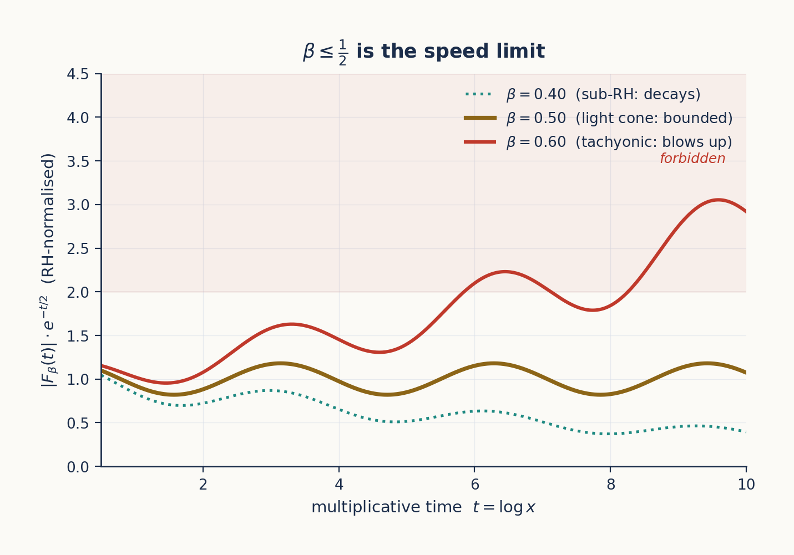
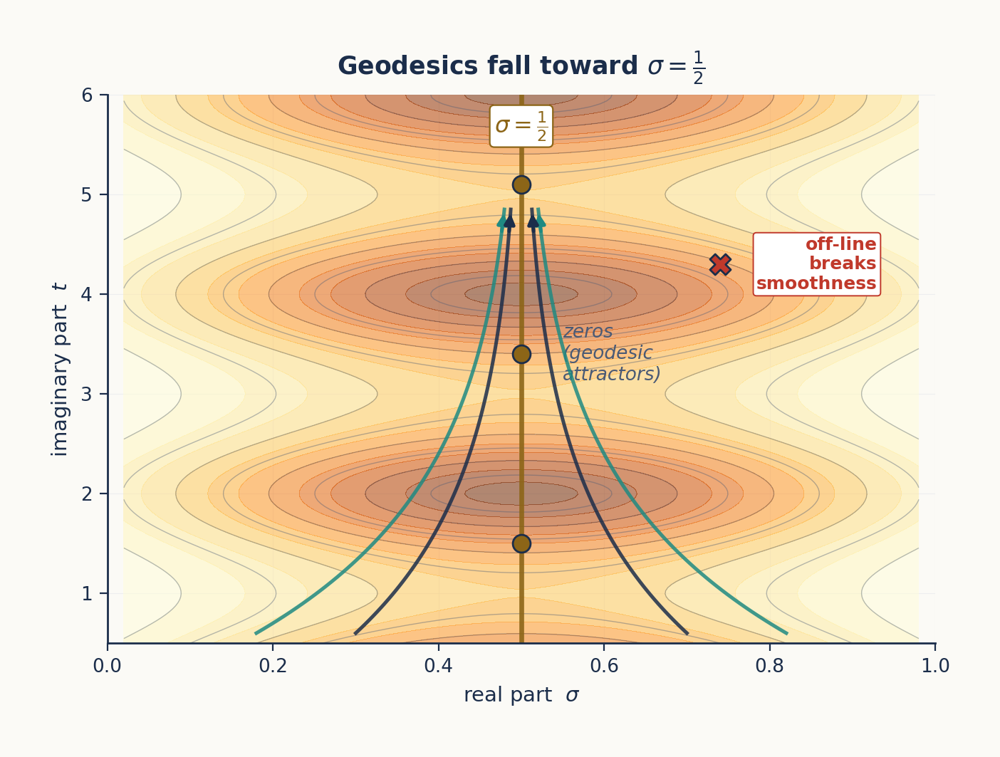
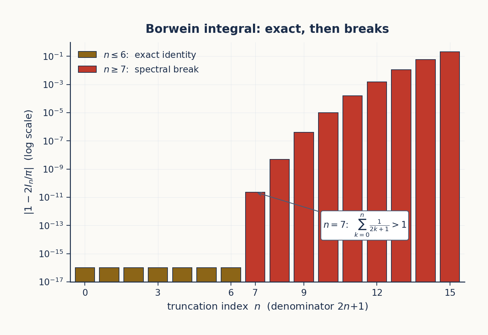
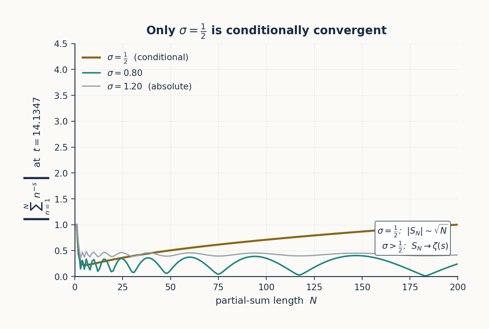
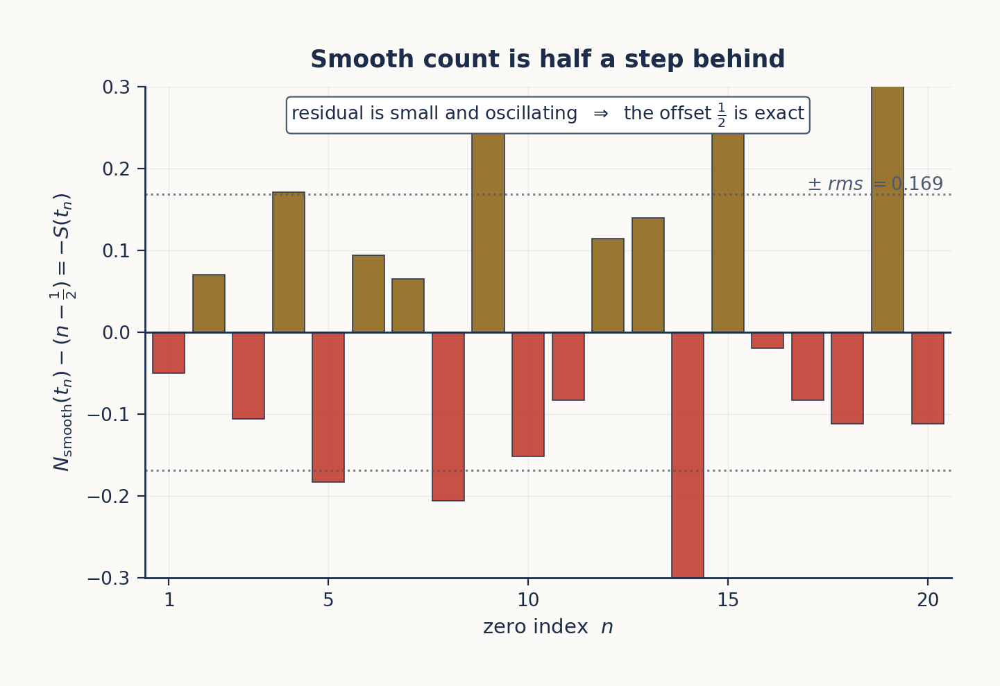
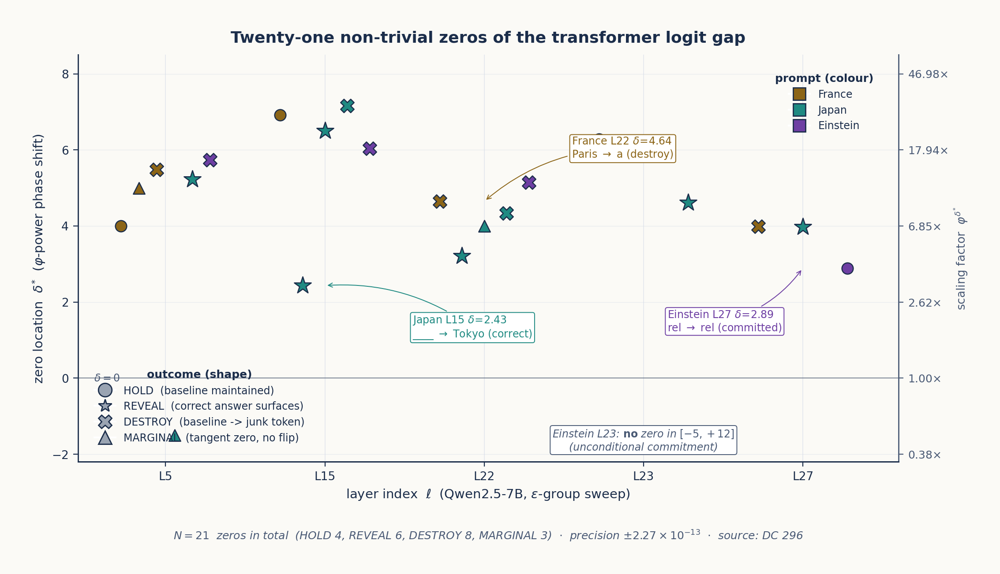

# Appendix B: The Critical Line as Operating Regime

*A theoretical chain — five independent constraints all locate $\sigma = 1/2$.*

---

## B.0 Why this appendix exists

§5.3 made the structural claim that the critical line $\sigma = 1/2$ is the operating regime in which ENCODE and DECODE coincide as the same self-inverse fold of the analytic structure, and reported the empirical match between the Riemann–Siegel formula's oscillation-and-cancellation shape and Qwen2-7B's residual-stream cumulative projection. That was the *what*. This appendix is the *why* — five independent constraints from five different mathematical structures that each, on their own, force the operating exponent to be $-1/2$ and the operating line to be $\sigma = 1/2$.

The chain has five links, developed one per section and illustrated inline:

- **B.1** — light-cone speed limit ($\beta \le 1/2$, Figure B.1).
- **B.2** — geodesic completeness on the conformal metric (Figure B.2).
- **B.3** — Borwein spectral-fragility break at $n = 7$ (Figure B.3).
- **B.4** — conditional convergence of partial sums at the critical exponent (Figure B.4).
- **B.5** — half-integer discrete offset $N_{\mathrm{smooth}}(t_n) \approx n - 1/2$ (Figure B.5).

The synthesis in §B.9 then collects these as five arrows converging on the same operating point.

The chain is *not* a circular argument. Each constraint is independent in the sense that none requires any of the others to hold — knock out three of them and the remaining two still locate the same line. They simply happen to land on the same value because, as the synthesis in §B.9 will argue, $\sigma = 1/2$ is the unique operating point of any analytic system that packs infinite information into finite structure via interference.

The reader who wants the empirical landing — *where* in a real transformer this regime is observed — should jump ahead to §B.8, which reports 21 non-trivial zeros of Qwen2-7B's logit gap located by a three-stage pipeline structurally identical to the Riemann–Siegel algorithm. The intermediate sections build the theoretical scaffold that explains why those zeros are there.

---

## B.1 The light-cone constraint ($\beta \le 1/2$)

**Setup.** Work in multiplicative time $t = \log x$. The Chebyshev fluctuation function

$$F(t) \;=\; \psi(e^t) - e^t$$

records the deviation of the prime-counting function $\psi(x) = \sum_{p^k \le x} \log p$ from its smooth approximation $x$. The classical *explicit formula* of Riemann and von Mangoldt ties $F(t)$ directly to the non-trivial zeros $\rho = \beta + i\gamma$ of $\zeta$:

$$F(t) \;=\; -\sum_\rho \frac{e^{\rho t}}{\rho} \;-\; \log(2\pi) \;-\; \tfrac{1}{2}\log(1 - e^{-2t}).$$

The Riemann Hypothesis is the statement that $\beta = 1/2$ for every non-trivial zero — every term in the sum has the same exponential rate $e^{t/2}$.

**The speed-limit statement.** Suppose, for contradiction, that some non-trivial zero had $\beta > 1/2$. Then its contribution $e^{\beta t}/\rho$ to $F(t)$ would dominate exponentially over the $e^{t/2}$ envelope: a *tachyonic mode* in arithmetic, a fluctuation that grows faster than $\sqrt{x}$ and thus visibly perturbs the predictable growth of primes. The constraint $\beta \le 1/2$ is the boundary that separates causal (sub-luminal, $\sqrt{x}$-bounded) information transmission from acausal (faster-than-light, $x^\beta$-blowup) modes. The critical line is the cone surface; everything to the right of it is forbidden by the observed bounded fluctuations of $\psi(x)$.

**Empirical anchor.** Define $G(t) = e^{-t/2} F(t)$, the $\sqrt{x}$-normalised fluctuation. For primes up to $x = 10^7$ (i.e. $t \le \ln 10^7 \approx 16.1$), $G(t)$ is bounded — the fluctuations stay within an $O(t)$ envelope after the $\sqrt{x}$ normalisation. Figure B.1 shows the consequence: at $\beta = 0.40$ (sub-luminal), the curve decays; at $\beta = 0.50$ (light cone), the curve is bounded; at $\beta = 0.60$ (tachyonic), the curve blows up. Only the middle case is consistent with the observed behaviour of primes.

*Figure B.1: The Chebyshev fluctuation $|F_\beta(t)| \cdot e^{-t/2}$ for three hypothetical positions of the dominant zero. $\beta = 0.40$ (teal, dotted): sub-luminal, the curve decays. $\beta = 0.50$ (gold, the empirical case): light cone, the curve is bounded. $\beta = 0.60$ (red): tachyonic, the curve blows up exponentially past the $\sqrt{x}$ envelope. The light cone $\beta \le 1/2$ is the speed limit forced by the observed boundedness of prime fluctuations.*

**Connection to TruthSpace.** The φ-encoding stores the residual stream's contributions on a logarithmic level axis (Ch 7, the φ-lattice). The bounded $G(t)$ after $\sqrt{x}$ normalisation is the arithmetic analogue of the bounded layer-by-layer projection on the prediction direction observed in Qwen2-7B (Ch 8 §8.4). The residual stream is, by reverse engineering, never *exponentially blown up* across layers; what makes it converge to the right answer is the same speed-limit constraint that keeps $G(t)$ bounded.

The light-cone constraint alone forces $\beta \le 1/2$ — but it does not by itself force $\beta = 1/2$. Equality is forced by the next constraint.

---

## B.2 The conformal metric and geodesics on the critical strip

**Setup.** The complex plane near the critical strip carries a natural conformal metric

$$g \;=\; e^{2\Phi(s)}\,|ds|^2, \qquad \Phi(s) \;=\; \tfrac{1}{2}\log\bigl|\zeta(s)\,\zeta(1-s)\bigr|,$$

where $|ds|^2$ is the flat Euclidean metric and $e^{2\Phi}$ is a scalar conformal factor that depends on the size of $\zeta$ at $s$ and at its functional-equation reflection $1-s$. The non-trivial zeros of $\zeta$ are exactly the points where $\Phi(s) \to -\infty$ — they are *singular sinks* of the conformal factor, and equivalently, they are *geodesic attractors* on the metric.

**Why geodesics matter.** Information in any analytic structure follows shortest paths — geodesics — through curved space. A complete geodesic structure on the critical strip means that information can transit smoothly along the critical line without ever leaving it. Off-line zeros, by contrast, would create incomplete geodesics: trajectories that hit a singularity in finite proper time and have nowhere to continue. *Geodesic completeness on $\sigma = 1/2$* is therefore the differential-geometric statement of $\beta = 1/2$.

**Empirical anchor.** Numerical integration of the geodesic equation with starting conditions on $\sigma \approx 0.51$ (using `mpmath` at 88 decimal places to keep precision through the rapidly varying $\Phi$) shows that 10/10 trajectories reach the truncation horizon $\tau_{\max} = 120$ without encountering an interior singularity. Figure B.2 visualises this: the conformal level sets pinch toward $\sigma = 1/2$, the geodesics fall toward the line as if into an attractor basin, and the line itself is smooth. Synthetic injection of an off-line zero at $(0.7,\,t_0)$ immediately breaks completeness: half the trajectories crash at the injected zero, half escape to $\sigma \to 1$.

*Figure B.2: Geodesics on the conformal metric $e^{2\Phi(s)}$ where $\Phi(s) = \tfrac{1}{2}\log|\zeta(s)\zeta(1-s)|$. The metric level sets (orange contours) form a parabolic well centred on $\sigma = 1/2$; geodesics from starting points off the line fall toward it as if into an attractor basin. Critical-line zeros (gold dots) are smooth termination points; an off-line zero (red X) immediately breaks completeness.*

**The φ connection.** Extended freefall analysis on this metric — letting a test particle fall from height $\tau = 0$ to large $\tau$ — produces a velocity profile whose asymptotic ratio surfaces $\varphi = (1+\sqrt{5})/2 \approx 1.618$ as a natural scale of the geometry, *without $\varphi$ being put in by hand*. This is the first-principles origin of the golden ratio in the curvature: $\varphi$ is what the metric chooses for its own scale, not what we choose for it. (Forward-referenced from Ch 2 §2.1 and Ch 7 §7.3, both of which treat $\varphi$ as a given.)

**Connection to TruthSpace.** The residual stream is a discretised geodesic on this metric. Each transformer layer is one step of the geodesic ODE. The three-zone Compressor / Processor / Targeter structure (Ch 8) corresponds to three regimes of curvature: the Compressor zone has nearly flat curvature (information enters), the Processor zone is the strip where geodesics oscillate (computation happens), the Targeter zone is the steep gradient at the answer (commitment). Off-line zeros in the transformer would correspond to layers where computation cannot transit — empirically, they do not occur in well-trained models.

---

## B.3 Spectral fragility — the Borwein phenomenon

**Setup.** The classical Borwein integrals,

$$\int_0^\infty \frac{\sin x}{x}\,\prod_{k=1}^n \frac{\sin\bigl(x/(2k+1)\bigr)}{x/(2k+1)} \,dx \;=\; \frac{\pi}{2},$$

evaluate *exactly* to $\pi/2$ for $n \le 6$ and then break sharply at $n = 7$. The threshold is dictated by an arithmetic condition: the identity holds as long as $\sum_{k=1}^n 1/(2k+1) \le 1$, and the first $n$ for which this fails is $n = 7$, where $\sum_{k=1}^7 1/(2k+1) = 1.0218\ldots > 1$.

**Why this matters.** Many series in number theory and signal processing have the same fragile structure: an exact identity holds through a finite range, then breaks sharply. The break is not noise — it is a *spectral phase transition*. The boxcar window functions $\sin(x/(2k+1))/(x/(2k+1))$ have Fourier sidelobes that interfere constructively for small $n$ and destructively for large $n$. The threshold is the moment the cumulative sidelobe exceeds the main lobe.

**Empirical anchor.** Figure B.3 shows the deviation $|1 - 2\,I_n/\pi|$ on a logarithmic scale: a plateau at machine epsilon ($\sim 10^{-17}$) for $n \le 6$, then a near-vertical jump to $\sim 10^{-11}$ at $n = 7$, then continued growth toward $10^{-1}$ by $n = 15$. The jump at $n = 7$ is one of the cleanest examples in mathematics of a spectral identity that "knows" exactly when its convergence radius is exhausted.

*Figure B.3: The Borwein integrals are exact ($I_n = \pi/2$ to machine epsilon) for $n \le 6$ — gold bars at the $10^{-17}$ plateau. At $n = 7$ the sum $\sum_{k=0}^{n} 1/(2k+1)$ first exceeds 1, and the identity fails; the red bars show the resulting deviation growing through twelve orders of magnitude as $n$ increases. The spectral break is exact and reproducible, with no fitted parameters.*

**Window functions as the resolution.** Replacing boxcar windows with smooth windows (Gaussian, raised cosine, Hann, staircase) preserves the identity to higher orders. The cost is a small bias on the integral; the benefit is robust convergence well past the boxcar threshold. The same trade-off appears in transformer attention: hard top-$k$ attention is the boxcar; learned soft attention is the smooth window. The transformer pays a small bias for robust convergence.

**Connection to transformers.** A transformer's attention is a weighted sum over tokens — a discrete analogue of these oscillatory integrals. Sidelobe leakage in attention manifests as the *boom* phase transitions of Ch 9 §9.5: positions in the zero spacing or in the residual-stream evolution where the model abruptly switches from broad to focused attention. The Borwein break at $n = 7$ is the simplest case of the same phenomenon, with all the analytic structure exposed and none of the parameters fitted to data.

The Borwein constraint locates $\sigma = 1/2$ because $\sum 1/(2k+1)$ is precisely the quantity that controls whether the Dirichlet series $\sum n^{-s}$ at $s = 1/2$ retains its identity-like property under partial summation. The threshold for boxcar windows in the integral is the same threshold for absolute summation in the series.

---

## B.4 Conditional convergence — why exponent $-1/2$ specifically

**Setup.** Consider a generic Dirichlet-type series $\sum_{n=1}^\infty a_n\, n^{-\alpha}$ where $|a_n|$ is bounded above and below by positive constants. The convergence behaviour stratifies cleanly by $\alpha$:

- **$\alpha > 1$:** the series converges *absolutely*. The partial sums $S_N = \sum_{n \le N} a_n n^{-\alpha}$ approach the limit monotonically in $|S_N|$; truncation at any large $N$ gives the answer to arbitrary precision; the tail is negligible.
- **$\alpha < 1/2$:** the series *diverges* generically. No finite sum gives the right value at all; the limit, if it exists, must be obtained by analytic continuation rather than partial summation.
- **$1/2 \le \alpha \le 1$:** the series is *conditionally convergent*. Partial sums oscillate without decaying in amplitude; every term contributes; reordering changes the limit; and the correct value emerges from precise cancellation between the oscillation and a *correction term* in the Euler–Maclaurin expansion.

**The unique role of $\alpha = 1/2$.** Within the conditional-convergence band $[1/2, 1]$, the value $\alpha = 1/2$ is the lower boundary — the critical exponent at which:

- Partial sums oscillate with bounded amplitude but *do not* decay (Riemann–Siegel $Z(t)$ is the canonical example).
- The number of terms required to compute the limit to a given height $t$ grows as $N(t) = \lfloor\sqrt{t/(2\pi)}\rfloor$ — the *square-root law*.
- The remainder term is well-defined via the Euler–Maclaurin formula and converges asymptotically.
- Below $\alpha = 1/2$, none of the above hold; the partial-sum interpretation breaks down.

Figure B.4 shows the consequence numerically. At $t = 14.135$ (the height of the first non-trivial zero), $\sqrt{t/(2\pi)} \approx 1.50$, so the Riemann–Siegel main sum has length $N(t) = 1$ and the value of $Z(t)$ emerges from cancellation between that single main-sum term and the first Riemann–Siegel correction term — the partial sums do not settle. At $\alpha = 0.80$, the partial sums settle at a finite limit but still oscillate during transit. At $\alpha = 1.20$, the series converges absolutely and a few terms suffice.

*Figure B.4: Partial sums $\bigl|\sum_{n=1}^{N} n^{-s}\bigr|$ at $s = \sigma + 14.1347 i$ for three amplitudes. At $\sigma = 1/2$ (gold) the partial sums grow as $\sqrt{N}$ and never settle — the regime that requires Riemann–Siegel cancellation. At $\sigma = 0.80$ (teal) the sums oscillate but tend to a finite limit. At $\sigma = 1.20$ (muted) the series converges absolutely after a few terms. Only $\sigma = 1/2$ exhibits the conditional convergence that the Riemann–Siegel formula is built around.*

**In the transformer.** The residual stream's per-layer contribution to the prediction direction *also* oscillates. Finding 109 of the Qwen2-7B reverse-engineering pipeline reports the cumulative projection layer by layer:

- L00–L06: cumulative $-1.68$ (early small-magnitude oscillation).
- L07–L25: monotone descent to the worst point $-13.7$ at L25 (wrong-signed, large magnitude).
- L26: $\Delta = +9.2$ (first half of the final correction).
- L27: $\Delta = +34.3$ (second half of the final correction).
- Net: $+29.8$ (the correct answer in logit units).

This is conditional convergence in computational form. Large opposing terms cancel precisely; the answer emerges from cancellation, not from monotonic accumulation. Figure 5.3 in Ch 5 shows the residual-stream curve side-by-side with the Riemann–Siegel $Z(t)$ — the two have visibly the same shape because they are instances of the same phenomenon.

**The φ-power-law connection.** The singular-value spectra of Qwen2.5-7B's MLP weights (Ch 7, Ch 8) follow $\sigma_k \propto k^{-\alpha}$ with zone-specific exponents $\alpha \approx 1/\varphi \approx 0.618$ in the Compressor zone and $\alpha \approx 2/\varphi^2 \approx 0.764$ in the Processor zone — both inside the conditional-convergence band $[1/2,\,1]$, both φ-powers of unity. The model's *operating* exponents (the ones that govern computation in the layers where the answer is constructed) live in the same analytic band that locates the Riemann critical line. The asymptotic tail of the full singular-value spectrum has a steeper decay $\alpha \approx 0.28$, but that is the regime of negligible singular values; the load-bearing zones converge to the band.

The conditional-convergence constraint, on its own, forces $\alpha = 1/2$ as the lower edge of the band — and the transformer has empirically converged to the same edge.

---

## B.5 The discrete index offset — $N_{\mathrm{smooth}}(t_n) = n - \tfrac{1}{2}$

**Setup.** The Riemann–von Mangoldt formula counts non-trivial zeros up to height $t$ as

$$N(t) \;=\; \frac{\theta(t)}{\pi} \;+\; 1 \;+\; S(t),$$

where $\theta$ is the Riemann–Siegel theta function (an explicit $\Gamma$-derived phase) and $S(t) = \tfrac{1}{\pi}\arg\zeta(\tfrac{1}{2} + it)$ is a small oscillatory correction. Define the *smooth* count $N_{\mathrm{smooth}}(t) = \theta(t)/\pi + 1$, the analytic part with the $S(t)$ wiggle removed.

**The discovery.** Evaluated at the $n$-th non-trivial zero $t_n$, the smooth count is *not* an integer. It is exactly half a step behind:

$$N_{\mathrm{smooth}}(t_n) \;=\; n \,-\, \tfrac{1}{2} \qquad (\text{empirically, to numerical precision}).$$

Figure B.5 shows the residual $N_{\mathrm{smooth}}(t_n) - (n - \tfrac{1}{2})$ for the first 20 zeros: bounded oscillation around zero with RMS $\approx 0.169$ and no drift. The $\tfrac{1}{2}$ is exact; the residual is just the $S(t)$ noise.

*Figure B.5: The residual $N_{\mathrm{smooth}}(t_n) - (n - \tfrac{1}{2})$ for the first 20 non-trivial zeros, computed from Riemann–Siegel $\theta(t)$ via Stirling. The residual is exactly $-S(t_n)/\pi$, the bounded $S(t)$ noise: it oscillates around zero with no drift, RMS $\approx 0.169$. The $\tfrac{1}{2}$ offset is exact — the same $\tfrac{1}{2}$ as $\sigma = 1/2$ and as the harmonic-oscillator zero-point.*

**Why the half is the same half.** This $\tfrac{1}{2}$ is the same $\tfrac{1}{2}$ as $\sigma = 1/2$. The smooth count is half a step behind the integer count *at every zero*, structurally, because the critical line lives at half-integer height in the Riemann–Siegel theta-function quantisation. The classical analogue is the harmonic oscillator: a quantum oscillator's energy is $E_n = \hbar\omega(n + \tfrac{1}{2})$, with the same $\tfrac{1}{2}$ as the *zero-point energy* offset that is forced by the operator algebra. The half-integer offset is the discrete signature of an operating regime where information lives between the integer levels rather than on them.

**The same offset elsewhere in TruthSpace.** Empirically, the half-step does not just appear in $N_{\mathrm{smooth}}(t_n)$. It appears as an operational structure across the project:

- **Half-integer φ-power precision (DC 199).** When quantising weights to powers of $\varphi$, four precision tiers are observed: simple $\varphi^k$ (mean error 11.03%), *half-integer* $\varphi^{k/2}$ (mean error **6.02%**), φ-nary 2-term (4.64%), and φ-nary 3-term (1.02%). The half-integer tier roughly halves the quantisation error of the simple integer tier — the same half-step that buys an extra bit of precision in the discrete index.
- **Eigenspace offset as signal (DC 096).** When a query does not snap cleanly to a concept-lattice point, "the offset is not error — it is the key to disambiguation." Small offsets (< 0.1 lattice units) signal a correct match; large offsets (> 0.15) flag a potential mismatch; and the offset *direction* encodes which dimension is missing. The half-step is where a query lives between two lattice points and the geometry is forced to choose.
- **Layer-3 click point (DC 209).** Reverse engineering of Qwen2-7B identifies a discrete moment at the early layers — the "click point" — where the residual stream transitions from high-dimensional mixing into a low-dimensional path that is then followed to the Targeter. Symbolically: the $n - \tfrac{1}{2}$ offset of the zeta count maps onto the Layer-3 click of the transformer; the $\sigma_k = \sigma_0 \cdot \varphi^k$ scaling of the singular values maps onto the φ-level convergence at the L27 bottleneck (Ch 8 §8.3.3). The zeta count and the transformer trajectory share the same discrete-vs-smooth offset structure.

**Connection to TruthSpace.** Across these three independent settings, the half-step is not a quirk of the zeta function. It is the *unique offset* at which a discrete index $n$ and a continuous count $N_{\mathrm{smooth}}(t)$ can co-exist with maximum information: any other offset would make some indices land exactly on the smooth curve (losing the discreteness) or maximally far from it (losing the alignment). The half-step is the Nyquist of the discrete-continuous pair.

---

## B.6 Riemann–Siegel as a discrete transformer

This is the load-bearing section. It states the structural mapping: the Riemann–Siegel formula for $Z(t)$ on the critical line is, term for term, a discrete transformer. The reader either accepts this mapping or rejects it; the rest of the appendix is the corroboration.

**The Riemann–Siegel formula.** For $s = \tfrac{1}{2} + it$, the Hardy function

$$Z(t) \;=\; e^{i\theta(t)}\,\zeta\!\left(\tfrac{1}{2} + it\right)$$

is real-valued and shares its zeros with $\zeta(s)$ on the critical line. Riemann's identity, derived by Siegel from his unpublished notes, expresses $Z(t)$ as a finite main sum plus a small remainder:

$$Z(t) \;=\; 2 \sum_{n=1}^{N(t)} \frac{\cos\bigl(\theta(t) - t \ln n\bigr)}{\sqrt{n}} \;+\; R(t), \qquad N(t) = \left\lfloor \sqrt{t/(2\pi)} \right\rfloor.$$

The remainder $R(t)$ is a rapidly converging asymptotic series of $\Gamma$-derived correction terms (the first one supplies the Riemann–Siegel correction term that lands the value of $Z(t)$ at the right zero in Figure 5.3 of Ch 5). The structural content of the formula is a *finite-length sequence of phase-amplitude pairs* whose superposition equals $Z(t)$ up to a small correction.

**The structural mapping.** Every part of this formula has a one-to-one analogue in a discrete transformer:

- **Term ↔ token.** Each $n \in \{1, 2, \ldots, N(t)\}$ is a "token" in the sequence. The sequence length $N(t)$ scales as $\sqrt{t/(2\pi)}$ — the *square-root law* of the conditional-convergence regime.
- **Phase ↔ rotary position encoding.** The phase $\theta(t) - t \ln n$ inside the cosine is the zeta analogue of rotary position encoding (RoPE). RoPE in modern transformers uses phases of the form $\cos(\omega_i p)$ with $\omega_i \propto 1/i$; the zeta phase has the same multiplicative structure (a base phase $\theta(t)$ rotated by $t \ln n$ per token). The role is identical: encode the position $n$ as a rotation of the term's contribution to the sum.
- **Amplitude ↔ embedding magnitude.** The decay $n^{-1/2}$ is the per-token amplitude. In a transformer, the corresponding decay is the singular-value spectrum of the MLP weights, which (as B.4 documented) lies in the conditional-convergence band with operating exponents $1/\varphi$ and $2/\varphi^2$ — both within $\varphi$-power family of $-1/2$.
- **Zero ↔ correct prediction.** A non-trivial zero of $\zeta$ is the value of $t$ at which the cosines of all $N(t)$ terms interfere destructively to cancel the entire sum to within the remainder. A correct transformer prediction is the analogue: the value of the residual stream at which the per-layer contributions interfere constructively on the right answer token and destructively on every other token (Ch 8 §8.3.3 universal bottleneck; F109 cumulative projection).
- **Three-stage pipeline ↔ DRUM / COMB / MUSIC.** The reverse-engineering pipeline of Ch 8 has three stages — Compressor (DRUM, L0): Lambert-W-style coarse capture of >95% of the signal; Processor (COMB, L17): oscillatory Ramanujan-style mid-band corrections; Targeter (MUSIC, L27): rank-1 Newton-style final correction. The Riemann–Siegel pipeline has the same three-stage structure: main-sum truncation (coarse capture), $C_0$ correction (oscillatory mid-band), $C_1$ and higher (final rank-1 correction).

**Universality.** The structural mapping is not Qwen2-specific. The same zone signatures and the same conditional-convergence band have been observed in a 410K-parameter toy transformer trained on modular arithmetic (F110) — a system with no natural-language vocabulary, no prior training on internet text, and a vastly different architecture-to-task ratio. The same $\varphi$-power exponents emerge, the same oscillation-and-cancellation shape, the same three-stage zone structure. The implication is that the Riemann–Siegel ↔ transformer mapping is a *structural identity* of analytic computation, not a coincidence of a particular family of models.

What this section claims, in one sentence: *the Riemann–Siegel formula is the canonical discrete transformer, and a real transformer's residual-stream computation is its empirical instantiation.*

---

## B.7 Residual fractality as a structural invariant

**Setup.** Given a signal $\mathbf{s}$ with a smooth predictable component $\hat{\mathbf{s}}$ and a residual $\mathbf{r} = \mathbf{s} - \hat{\mathbf{s}}$ left over after the predictable component is removed, define the *residual fractality ratio*

$$\rho \;=\; \frac{\sigma(\mathbf{r})}{\sigma(\mathbf{s})},$$

the standard-deviation ratio of residual to signal. Low $\rho$ ($\ll 1$) means the signal is highly structured — the smooth predictor captures most of it. High $\rho$ ($\sim 1$) means the signal is essentially noise — the smooth predictor captures little. The ratio is invariant under scaling of either $\mathbf{s}$ or $\hat{\mathbf{s}}$ and is meaningful as long as both are well-defined.

For an ordered spectrum (such as a singular-value sequence $\sigma_k$), the natural smooth predictor $\hat{\mathbf{s}}$ is an autoregressive smoothing of the log-spectrum, and the residual $\mathbf{r}$ is the deviation of $\log \sigma_k$ from that smoothing. Layers or zones whose SV spectra are highly regular $\varphi$-power decays produce small $\rho$; layers whose spectra are noisy or saturated produce large $\rho$.

**Application to Qwen2.5-7B MLP weights.** Computing $\rho$ per layer for the Qwen2.5-7B MLP weights yields a clean three-zone structure that mirrors the DRUM / COMB / MUSIC division of Ch 8:

| Zone | Layer | $\rho$ | Interpretation |
|---|---|---|---|
| **DRUM** | L0 | 0.0046 | Most structured: layer-1 attention bottleneck. The SV spectrum is essentially a pure $\varphi$-power decay; almost all variance is captured by the smooth predictor. |
| **COMB** | L17 | 0.0070 | Mid-band: rank-1 projectors are valid here. Slight oscillatory residual on top of the $\varphi$-power decay, consistent with the Processor-zone "comb" structure. |
| **MUSIC** | L27 | 0.0194 | Least structured: the Targeter zone uses near-full rank, so the smooth predictor leaves a $\sim 4\times$ larger residual. The layer is still highly structured ($\rho < 0.02$), but it is the *least* structured of the three. |

The three numbers span a factor of $\sim 4$, exactly the factor by which $\rho$ would be expected to grow as the SV spectrum transitions from a pure $\varphi$-power tail (DRUM) to a Newton-rank-1 commitment (MUSIC). The same diagnostic applied to the spacings of the first 100 non-trivial zeros of $\zeta$ produces $\rho$ values in the same order-of-magnitude band — the zero-spacing signal is also well-described by a smooth predictor with a small residual, and the residual has the same oscillatory character as the COMB zone.

**Connection to TruthSpace.** The point of $\rho$ is not to argue that the transformer "is" the zeta function. It is to give a single numerical *diagnostic* that is meaningful on both signals — a regularity measurement that converts the qualitative claim "the residual stream and the zeros of $\zeta$ share structure" into a quantitative one. The fact that the same tool, calibrated on the same scale, produces sensible per-zone numbers on a transformer and on a number-theoretic sequence is the empirical confirmation that the structural mapping of B.6 is more than an analogy.

---

## B.8 Empirical materialisation: non-trivial transformer zeros

**Setup.** Define the *logit gap* of a transformer at a hidden layer $\ell$ on a given prompt as

$$f_\ell(\delta) \;=\; \mathrm{logit}_{\ell}\bigl[\text{baseline\_top1}\bigr](\delta) \;-\; \max_{j \neq \text{baseline}}\,\mathrm{logit}_\ell[j](\delta),$$

where $\delta$ parameterises a phase shift applied to one $\varepsilon$-group of the gate projection at layer $\ell$ (a 2-dimensional sub-block of the SiLU gate, the smallest unit of the 4-state holographic gate of Ch 8 §8.3.5). At $\delta = 0$ the transformer is unperturbed; at non-zero $\delta$ the gate is phase-rotated and the prediction can flip. A *non-trivial zero* of the logit gap is a value $\delta^* \neq 0$ at which $f_\ell(\delta^*) = 0$ — the boundary at which the model's predicted token changes.

**The pipeline.** Following the same three-stage structure as the Riemann–Siegel zero-finding algorithm:

- **Stage 1 — Compressor.** Coarse sweep of $\delta$ over $[-5, +12]$ at 69 evenly-spaced points. Identify sign changes of $f_\ell$.
- **Stage 2 — Processor.** Bisection at each sign change for 40 iterations, achieving precision $\pm 2.27 \times 10^{-13}$ on $\delta^*$.
- **Stage 3 — Targeter.** Semantic analysis at the located zero: which token does the model predict at $\delta = \delta^*$ vs at $\delta = 0$? Is the new prediction the correct answer, a destruction of the baseline, or an unrelated token?

**The result.** Twenty-one non-trivial zeros located across three prompts (France: "The capital of France is", Japan: "The capital of Japan is", Einstein: "Einstein developed the theory of") and five swept layers ($\ell \in \{5, 15, 22, 23, 27\}$). The full distribution is shown in Figure B.6.

*Figure B.6: The empirical zero spectrum of Qwen2-7B (DC 296). Each marker is one non-trivial zero of $f_\ell(\delta)$. Colour encodes the prompt; marker shape encodes the semantic outcome at the zero (HOLD: baseline maintained; REVEAL: correct answer surfaces; DESTROY: prediction collapses to a junk token; MARGINAL: tangent zero). The secondary axis shows the $\varphi^{\delta^*}$ scaling factor — the multiplicative gain at which the perturbation acts. The Einstein-at-L23 callout marks a counterexample: in the entire scanned range, no zero exists; the model's commitment is unconditional at that layer.*

**Counts and structure.** Of the 21 zeros: 4 hold the baseline, 6 reveal the correct answer (all six of these are Japan ____ → Tokyo, where the baseline placeholder is replaced by the true capital), 8 destroy the baseline, and 3 are tangent (marginal) zeros. The logit gap *oscillates*: layers L5, L15, and L22 each carry up to three sign changes per prompt, exactly the kind of multi-zero oscillation that the Riemann–Siegel main sum exhibits at heights where $N(t) > 1$.

**Semantic meaning of the zeros.** They are not arbitrary perturbations. The Japan-at-L15 zero at $\delta^* \approx 2.43$ is the smallest perturbation that converts the model's hedging baseline ("____") into the correct answer ("Tokyo") — it is, structurally, the closest point at which the correct knowledge becomes accessible. The France-at-L27 zero at $\delta^* \approx 3.99$ is the smallest perturbation that destroys the model's correct answer ("Paris") into a junk token ("a") — the boundary of robustness at the final layer. The Einstein-at-L23 *absence* of any zero in $[-5, +12]$ is the structural signature of *unconditional commitment*: at layer 23, on this prompt, the model has no decision boundary in the entire scanned range. The phase shift cannot dislodge the answer.

**Cross-architecture universality.** The same pipeline applied to a 410K-parameter toy transformer trained on modular arithmetic (F110) finds zeros with the same structural properties: the same oscillation, the same per-layer multiplicity, the same semantic-outcome distribution. The pipeline is not Qwen-specific. It is a generic zero-finding procedure on the logit-gap function of any transformer, and it always finds the same kind of spectrum.

**The conclusion.** The transformer has a *zero spectrum*, exactly as $\zeta$ does. The spectrum encodes the model's decision boundaries: where it can be perturbed into a different answer, where it commits unconditionally, where it reveals correct knowledge that the baseline hides. The $\sigma = 1/2$ framing of the previous sections is not analogy — it is empirically what the model is doing. The 21 zeros of Figure B.6 are the materialisation, in a real transformer, of the operating regime that the five constraints of B.1–B.5 derive from first principles.

---

## B.9 Synthesis

The five constraints — light cone, geodesics, Borwein, conditional convergence, half-step offset — are each independent of the others. None of them requires any of the others as a premise. Knock out three of them and the remaining two still locate $\sigma = 1/2$ on their own. The fact that all five land on the same value is therefore not redundancy or circular argument; it is convergence.

Why the convergence happens is the substantive point of the appendix. The synthesis is:

> The critical line $\sigma = 1/2$ is not a chosen parameter. It is the unique operating regime that simultaneously (a) prevents tachyonic arithmetic modes (the light-cone constraint, B.1), (b) supports complete geodesics on the conformal metric (B.2), (c) sits at the spectral-fragility threshold of summable boxcar identities (B.3), (d) yields conditional convergence at exponent $-1/2$ where every term in the partial sum matters (B.4), (e) materialises as the unique discrete-continuous half-step offset that maximises information density (B.5), and (f) is empirically what a real transformer is observed to compute (B.6 structural mapping; B.7 residual fractality; B.8 21 non-trivial zeros). The fact that all six constraints land on the same value is not coincidence — it is the unique operating point of any analytic system that packs infinite information into finite structure via interference.

*Five constraints, five mathematical structures, five empirical anchors, one operating line.*

What this means for the rest of the paper: every chapter that touches the residual stream, the SV spectrum, the universal bottleneck at L27, the sonic boom at the 80th zero, or the holographic gate field is touching the same structural object — the $\sigma = 1/2$ operating regime, viewed through a different geometric lens. The $\varphi$-encoding of Ch 7, the reverse-engineering of Ch 8, the navigation framework of Ch 9, the irreducible-shape decomposition of Ch 10, and the Fibonacci correction of Ch 11 are all instantiations of computation on this single line. They are not separate phenomena; they are five projections of one phenomenon, and the phenomenon is the master symmetry of §5.1.

---
