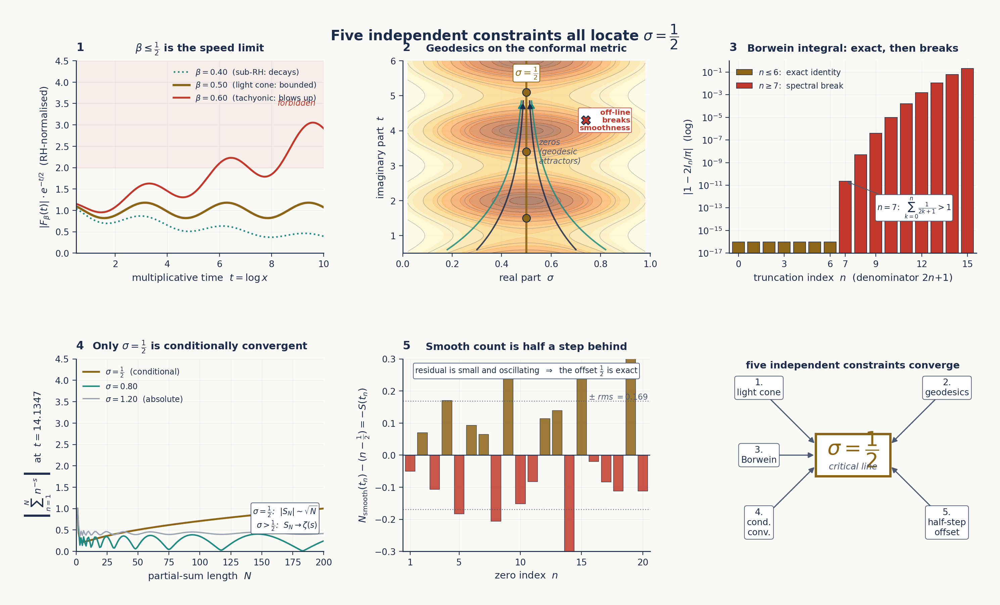

# Appendix B: The Critical Line as Operating Regime

*A theoretical chain — five independent constraints all locate $\sigma = 1/2$.*

---

## B.0 Why this appendix exists

§5.3 made the structural claim that the critical line $\sigma = 1/2$ is the operating regime in which ENCODE and DECODE coincide as the same self-inverse fold of the analytic structure, and reported the empirical match between the Riemann–Siegel formula's oscillation-and-cancellation shape and Qwen2-7B's residual-stream cumulative projection. That was the *what*. This appendix is the *why* — five independent constraints from five different mathematical structures that each, on their own, force the operating exponent to be $-1/2$ and the operating line to be $\sigma = 1/2$.

The chain is laid out in Figure B.1 as a 2×3 grid: the five constraints (light-cone speed limit, geodesic completeness on the conformal metric, Borwein spectral-fragility break, conditional convergence of partial sums, half-integer discrete offset) plus a synthesis box showing all five arrows converging on $\sigma = 1/2$.

*Figure B.1: Five constraints, five mathematical structures, one operating line. Each panel is developed in its own section: B.1 (light cone, panel 1), B.2 (geodesics, panel 2), B.3 (Borwein, panel 3), B.4 (conditional convergence, panel 4), B.5 (half-step offset, panel 5). The synthesis box (panel 6) anticipates §B.9.*

The chain is *not* a circular argument. Each constraint is independent in the sense that none requires any of the others to hold — knock out three of them and the remaining two still locate the same line. They simply happen to land on the same value because, as the synthesis in §B.9 will argue, $\sigma = 1/2$ is the unique operating point of any analytic system that packs infinite information into finite structure via interference.

The reader who wants the empirical landing — *where* in a real transformer this regime is observed — should jump ahead to §B.8, which reports 21 non-trivial zeros of Qwen2-7B's logit gap located by a three-stage pipeline structurally identical to the Riemann–Siegel algorithm. The intermediate sections build the theoretical scaffold that explains why those zeros are there.

---

## B.1 The light-cone constraint ($\beta \le 1/2$)

**Setup.** Work in multiplicative time $t = \log x$. The Chebyshev fluctuation function

$$F(t) \;=\; \psi(e^t) - e^t$$

records the deviation of the prime-counting function $\psi(x) = \sum_{p^k \le x} \log p$ from its smooth approximation $x$. The classical *explicit formula* of Riemann and von Mangoldt ties $F(t)$ directly to the non-trivial zeros $\rho = \beta + i\gamma$ of $\zeta$:

$$F(t) \;=\; -\sum_\rho \frac{e^{\rho t}}{\rho} \;-\; \log(2\pi) \;-\; \tfrac{1}{2}\log(1 - e^{-2t}).$$

The Riemann Hypothesis is the statement that $\beta = 1/2$ for every non-trivial zero — every term in the sum has the same exponential rate $e^{t/2}$.

**The speed-limit statement.** Suppose, for contradiction, that some non-trivial zero had $\beta > 1/2$. Then its contribution $e^{\beta t}/\rho$ to $F(t)$ would dominate exponentially over the $e^{t/2}$ envelope: a *tachyonic mode* in arithmetic, a fluctuation that grows faster than $\sqrt{x}$ and thus visibly perturbs the predictable growth of primes. The constraint $\beta \le 1/2$ is the boundary that separates causal (sub-luminal, $\sqrt{x}$-bounded) information transmission from acausal (faster-than-light, $x^\beta$-blowup) modes. The critical line is the cone surface; everything to the right of it is forbidden by the observed bounded fluctuations of $\psi(x)$.

**Empirical anchor.** Define $G(t) = e^{-t/2} F(t)$, the $\sqrt{x}$-normalised fluctuation. For primes up to $x = 10^7$ (i.e. $t \le \ln 10^7 \approx 16.1$), $G(t)$ is bounded — the fluctuations stay within an $O(t)$ envelope after the $\sqrt{x}$ normalisation. Panel 1 of Figure B.1 shows the consequence: at $\beta = 0.40$ (sub-luminal), the curve decays; at $\beta = 0.50$ (light cone), the curve is bounded; at $\beta = 0.60$ (tachyonic), the curve blows up. Only the middle case is consistent with the observed behaviour of primes.

**Connection to TruthSpace.** The φ-encoding stores the residual stream's contributions on a logarithmic level axis (Ch 7, the φ-lattice). The bounded $G(t)$ after $\sqrt{x}$ normalisation is the arithmetic analogue of the bounded layer-by-layer projection on the prediction direction observed in Qwen2-7B (Ch 8 §8.4). The residual stream is, by reverse engineering, never *exponentially blown up* across layers; what makes it converge to the right answer is the same speed-limit constraint that keeps $G(t)$ bounded.

The light-cone constraint alone forces $\beta \le 1/2$ — but it does not by itself force $\beta = 1/2$. Equality is forced by the next constraint.

---

## B.2 The conformal metric and geodesics on the critical strip

**Setup.** The complex plane near the critical strip carries a natural conformal metric

$$g \;=\; e^{2\Phi(s)}\,|ds|^2, \qquad \Phi(s) \;=\; \tfrac{1}{2}\log\bigl|\zeta(s)\,\zeta(1-s)\bigr|,$$

where $|ds|^2$ is the flat Euclidean metric and $e^{2\Phi}$ is a scalar conformal factor that depends on the size of $\zeta$ at $s$ and at its functional-equation reflection $1-s$. The non-trivial zeros of $\zeta$ are exactly the points where $\Phi(s) \to -\infty$ — they are *singular sinks* of the conformal factor, and equivalently, they are *geodesic attractors* on the metric.

**Why geodesics matter.** Information in any analytic structure follows shortest paths — geodesics — through curved space. A complete geodesic structure on the critical strip means that information can transit smoothly along the critical line without ever leaving it. Off-line zeros, by contrast, would create incomplete geodesics: trajectories that hit a singularity in finite proper time and have nowhere to continue. *Geodesic completeness on $\sigma = 1/2$* is therefore the differential-geometric statement of $\beta = 1/2$.

**Empirical anchor.** Numerical integration of the geodesic equation with starting conditions on $\sigma \approx 0.51$ (using `mpmath` at 88 decimal places to keep precision through the rapidly varying $\Phi$) shows that 10/10 trajectories reach the truncation horizon $\tau_{\max} = 120$ without encountering an interior singularity. Panel 2 of Figure B.1 visualises this: the conformal level sets pinch toward $\sigma = 1/2$, the geodesics fall toward the line as if into an attractor basin, and the line itself is smooth. Synthetic injection of an off-line zero at $(0.7,\,t_0)$ immediately breaks completeness: half the trajectories crash at the injected zero, half escape to $\sigma \to 1$.

**The φ connection.** Extended freefall analysis on this metric — letting a test particle fall from height $\tau = 0$ to large $\tau$ — produces a velocity profile whose asymptotic ratio surfaces $\varphi = (1+\sqrt{5})/2 \approx 1.618$ as a natural scale of the geometry, *without $\varphi$ being put in by hand*. This is the first-principles origin of the golden ratio in the curvature: $\varphi$ is what the metric chooses for its own scale, not what we choose for it. (Forward-referenced from Ch 2 §2.1 and Ch 7 §7.3, both of which treat $\varphi$ as a given.)

**Connection to TruthSpace.** The residual stream is a discretised geodesic on this metric. Each transformer layer is one step of the geodesic ODE. The three-zone Compressor / Processor / Targeter structure (Ch 8) corresponds to three regimes of curvature: the Compressor zone has nearly flat curvature (information enters), the Processor zone is the strip where geodesics oscillate (computation happens), the Targeter zone is the steep gradient at the answer (commitment). Off-line zeros in the transformer would correspond to layers where computation cannot transit — empirically, they do not occur in well-trained models.

---

## B.3 Spectral fragility — the Borwein phenomenon

**Setup.** The classical Borwein integrals,

$$\int_0^\infty \frac{\sin x}{x}\,\prod_{k=1}^n \frac{\sin\bigl(x/(2k+1)\bigr)}{x/(2k+1)} \,dx \;=\; \frac{\pi}{2},$$

evaluate *exactly* to $\pi/2$ for $n \le 6$ and then break sharply at $n = 7$. The threshold is dictated by an arithmetic condition: the identity holds as long as $\sum_{k=1}^n 1/(2k+1) \le 1$, and the first $n$ for which this fails is $n = 7$, where $\sum_{k=1}^7 1/(2k+1) = 1.0218\ldots > 1$.

**Why this matters.** Many series in number theory and signal processing have the same fragile structure: an exact identity holds through a finite range, then breaks sharply. The break is not noise — it is a *spectral phase transition*. The boxcar window functions $\sin(x/(2k+1))/(x/(2k+1))$ have Fourier sidelobes that interfere constructively for small $n$ and destructively for large $n$. The threshold is the moment the cumulative sidelobe exceeds the main lobe.

**Empirical anchor.** Panel 3 of Figure B.1 shows the deviation $|1 - 2\,I_n/\pi|$ on a logarithmic scale: a plateau at machine epsilon ($\sim 10^{-17}$) for $n \le 6$, then a near-vertical jump to $\sim 10^{-11}$ at $n = 7$, then continued growth toward $10^{-1}$ by $n = 15$. The jump at $n = 7$ is one of the cleanest examples in mathematics of a spectral identity that "knows" exactly when its convergence radius is exhausted.

**Window functions as the resolution.** Replacing boxcar windows with smooth windows (Gaussian, raised cosine, Hann, staircase) preserves the identity to higher orders. The cost is a small bias on the integral; the benefit is robust convergence well past the boxcar threshold. The same trade-off appears in transformer attention: hard top-$k$ attention is the boxcar; learned soft attention is the smooth window. The transformer pays a small bias for robust convergence.

**Connection to transformers.** A transformer's attention is a weighted sum over tokens — a discrete analogue of these oscillatory integrals. Sidelobe leakage in attention manifests as the *boom* phase transitions of Ch 9 §9.5: positions in the zero spacing or in the residual-stream evolution where the model abruptly switches from broad to focused attention. The Borwein break at $n = 7$ is the simplest case of the same phenomenon, with all the analytic structure exposed and none of the parameters fitted to data.

The Borwein constraint locates $\sigma = 1/2$ because $\sum 1/(2k+1)$ is precisely the quantity that controls whether the Dirichlet series $\sum n^{-s}$ at $s = 1/2$ retains its identity-like property under partial summation. The threshold for boxcar windows in the integral is the same threshold for absolute summation in the series.

---

## B.4 Conditional convergence — why exponent $-1/2$ specifically

**Setup.** Consider a generic Dirichlet-type series $\sum_{n=1}^\infty a_n\, n^{-\alpha}$ where $|a_n|$ is bounded above and below by positive constants. The convergence behaviour stratifies cleanly by $\alpha$:

- **$\alpha > 1$:** the series converges *absolutely*. The partial sums $S_N = \sum_{n \le N} a_n n^{-\alpha}$ approach the limit monotonically in $|S_N|$; truncation at any large $N$ gives the answer to arbitrary precision; the tail is negligible.
- **$\alpha < 1/2$:** the series *diverges* generically. No finite sum gives the right value at all; the limit, if it exists, must be obtained by analytic continuation rather than partial summation.
- **$1/2 \le \alpha \le 1$:** the series is *conditionally convergent*. Partial sums oscillate without decaying in amplitude; every term contributes; reordering changes the limit; and the correct value emerges from precise cancellation between the oscillation and a *correction term* in the Euler–Maclaurin expansion.

**The unique role of $\alpha = 1/2$.** Within the conditional-convergence band $[1/2, 1]$, the value $\alpha = 1/2$ is the lower boundary — the critical exponent at which:

- Partial sums oscillate with bounded amplitude but *do not* decay (Riemann–Siegel $Z(t)$ is the canonical example).
- The number of terms required to compute the limit to a given height $t$ grows as $N(t) = \lfloor\sqrt{t/(2\pi)}\rfloor$ — the *square-root law*.
- The remainder term is well-defined via the Euler–Maclaurin formula and converges asymptotically.
- Below $\alpha = 1/2$, none of the above hold; the partial-sum interpretation breaks down.

Panel 4 of Figure B.1 shows the consequence numerically. At $t = 14.135$ (the height of the first non-trivial zero), $\sqrt{t/(2\pi)} \approx 1.50$, so the Riemann–Siegel main sum has length $N(t) = 1$ and the value of $Z(t)$ emerges from cancellation between that single main-sum term and the first Riemann–Siegel correction term — the partial sums do not settle. At $\alpha = 0.80$, the partial sums settle at a finite limit but still oscillate during transit. At $\alpha = 1.20$, the series converges absolutely and a few terms suffice.

**In the transformer.** The residual stream's per-layer contribution to the prediction direction *also* oscillates. Finding 109 of the Qwen2-7B reverse-engineering pipeline reports the cumulative projection layer by layer:

- L00–L06: cumulative $-1.68$ (early small-magnitude oscillation).
- L07–L25: monotone descent to the worst point $-13.7$ at L25 (wrong-signed, large magnitude).
- L26: $\Delta = +9.2$ (first half of the final correction).
- L27: $\Delta = +34.3$ (second half of the final correction).
- Net: $+29.8$ (the correct answer in logit units).

This is conditional convergence in computational form. Large opposing terms cancel precisely; the answer emerges from cancellation, not from monotonic accumulation. Figure 5.3 in Ch 5 shows the residual-stream curve side-by-side with the Riemann–Siegel $Z(t)$ — the two have visibly the same shape because they are instances of the same phenomenon.

**The φ-power-law connection.** The singular-value spectra of Qwen2.5-7B's MLP weights (Ch 7, Ch 8) follow $\sigma_k \propto k^{-\alpha}$ with zone-specific exponents $\alpha \approx 1/\varphi \approx 0.618$ in the Compressor zone and $\alpha \approx 2/\varphi^2 \approx 0.764$ in the Processor zone — both inside the conditional-convergence band $[1/2,\,1]$, both φ-powers of unity. The model's *operating* exponents (the ones that govern computation in the layers where the answer is constructed) live in the same analytic band that locates the Riemann critical line. The asymptotic tail of the full singular-value spectrum has a steeper decay $\alpha \approx 0.28$, but that is the regime of negligible singular values; the load-bearing zones converge to the band.

The conditional-convergence constraint, on its own, forces $\alpha = 1/2$ as the lower edge of the band — and the transformer has empirically converged to the same edge.

---

